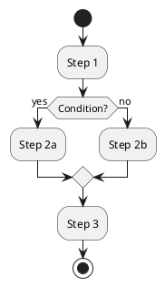

# PlantUML to Draw.io Converter

A tool for converting PlantUML diagrams to Draw.io format.

*[Deutsche Version weiter unten](#deutsche-version)*

<p align="center">
  
</p>

## 📋 Overview

This project enables the conversion of PlantUML diagrams to Draw.io format, allowing for seamless integration of UML diagrams into various documentation and presentation workflows. The converter currently supports activity diagrams and is continuously being expanded to support additional diagram types.

## ✨ Key Features

- 🔄 Conversion of PlantUML activity diagrams to Draw.io format
- 🔍 Automatic detection of PlantUML diagram type
- 🖥️ User-friendly GUI and command-line interface
- 📐 Automatic layout calculation for optimal diagram display
- 🧩 Modular design for easy extensibility

## 🚀 Quick Start

### Installation

```bash
# Clone repository
git clone https://github.com/doubleSlash-net/plantuml2drawio.git
cd plantuml2drawio

# Install dependencies
pip install -r requirements.txt

# Or install in development mode
pip install -e .
```

### Usage

#### Command Line

```bash
# Using the entry point scripts
./p2d-cli --input examples/activity_examples/simple_activity.puml --output output.drawio

# Or using Python modules
python -m src.plantuml2drawio.core --input examples/activity_examples/simple_activity.puml --output output.drawio
```

#### Graphical User Interface

```bash
# Using the entry point scripts
./p2d-gui

# Or using Python modules
python -m src.plantuml2drawio.app
```

## 📦 Project Structure

The project has been reorganized for better maintainability and extensibility:

```
plantuml2drawio/
├── README.md                    # This file
├── LICENSE                      # License information
├── requirements.txt             # Python dependencies
├── setup.py                     # Setup script for installation
├── plantuml2drawio-cli          # Command-line entry point
├── plantuml2drawio-gui          # GUI entry point
├── src/                         # Main source code
│   ├── plantuml2drawio/         # Core package
│   │   ├── core.py              # Core functionality
│   │   ├── app.py               # GUI application
│   │   └── config.py            # Configuration settings
│   └── processors/              # Diagram processors
│       ├── base_processor.py    # Base class for processors
│       └── activity_processor.py # Activity diagram processor
├── tests/                       # Tests
├── docs/                        # Documentation
├── examples/                    # Example diagrams
└── resources/                   # Resources like icons
```

## 📚 Documentation

Detailed documentation is available in the `docs` directory:

- [Installation and Usage](docs/Installation_und_Benutzung.md)
- [Workflow](docs/Arbeitsablauf.md)
- [System Architecture](docs/Systemarchitektur.md)
- [Extension Possibilities](docs/Erweiterungen.md)

## 🧪 Examples

The project contains examples in the `examples` directory:

### Activity Diagram

**PlantUML Input**:


**Draw.io Output**:

<p align="center">
  
</p>

## 🛠️ Technology Stack

- Python 3.6+
- customtkinter for GUI
- Regular expressions for parsing
- XML libraries for Draw.io generation

## 🗺️ Roadmap

- [x] Support for activity diagrams
- [ ] Support for usecase diagrams
- [ ] Support for sequence diagrams
- [ ] Support for class diagrams
- [ ] Support for component diagrams
- [ ] Advanced layout management
- [ ] Integration with PlantUML server
- [ ] Web interface

## 🤝 Contributing

Contributions are welcome! Check out the [Extension Possibilities](docs/Erweiterungen.md) to learn more about possible contributions.

## 📄 License

This project is licensed under the MIT License - see the [LICENSE](LICENSE) file for details.

## 🙏 Acknowledgements

- [PlantUML](https://plantuml.com/) for the excellent UML diagram syntax
- [Draw.io](https://www.draw.io/) for the open XML format and diagram editing functionality

---

<p align="center">
  Created with ❤️ for UML enthusiasts and software developers
</p>

---

<a name="deutsche-version"></a>
# Deutsche Version

## 📋 Übersicht

Dieses Projekt ermöglicht die Konvertierung von PlantUML-Diagrammen in das Draw.io-Format, wodurch eine nahtlose Integration von UML-Diagrammen in verschiedene Dokumentations- und Präsentationsworkflows ermöglicht wird. Der Konverter unterstützt derzeit Aktivitätsdiagramme und wird kontinuierlich um weitere Diagrammtypen erweitert.

## ✨ Hauptmerkmale

- 🔄 Konvertierung von PlantUML-Aktivitätsdiagrammen in das Draw.io-Format
- 🔍 Automatische Erkennung des PlantUML-Diagrammtyps
- 🖥️ Benutzerfreundliche GUI sowie Kommandozeilenschnittstelle
- 📐 Automatische Layout-Berechnung für optimale Diagrammdarstellung
- 🧩 Modularer Aufbau für einfache Erweiterbarkeit

## 🚀 Schnellstart

### Installation

```bash
# Repository klonen
git clone https://github.com/doubleSlash-net/plantuml2drawio.git
cd plantuml2drawio

# Abhängigkeiten installieren
pip install -r requirements.txt

# Oder im Entwicklungsmodus installieren
pip install -e .
```

### Verwendung

#### Kommandozeile

```bash
# Über die Einstiegsskripte
./p2d-cli --input examples/activity_examples/simple_activity.puml --output output.drawio

# Oder über Python-Module
python -m src.plantuml2drawio.core --input examples/activity_examples/simple_activity.puml --output output.drawio
```

#### Grafische Benutzeroberfläche

```bash
# Über die Einstiegsskripte
./p2d-gui

# Oder über Python-Module
python -m src.plantuml2drawio.app
```
