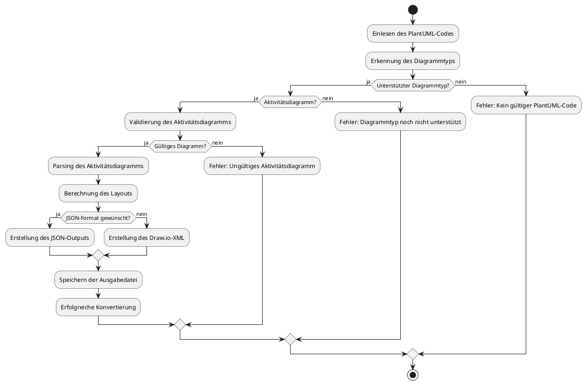
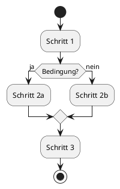

# Arbeitsablauf

Dieses Dokument beschreibt den detaillierten Arbeitsablauf bei der Konvertierung eines PlantUML-Diagramms in das Draw.io-Format.

## Gesamtprozess

Der vollständige Prozess der Konvertierung umfasst die folgenden Hauptschritte:



## Detaillierte Beschreibung der Schritte

### 1. Einlesen des PlantUML-Codes

Der Benutzer kann ein PlantUML-Diagramm auf zwei Arten eingeben:

1. **Über die Kommandozeile**:
   ```bash
   ./p2d-cli --input diagram.puml --output diagram.drawio
   ```

2. **Über die grafische Benutzeroberfläche**:
   - Starten der GUI mit `./p2d-gui`
   - Eingabe des PlantUML-Codes im Textfeld oder
   - Laden einer PlantUML-Datei über "Datei öffnen"

- **Verantwortliches Modul:** src/plantuml2drawio/core.py oder src/plantuml2drawio/app.py (je nach Schnittstelle)

### 2. Erkennung des Diagrammtyps

Das System analysiert den PlantUML-Code und erkennt den Diagrammtyp:

1. Suche nach charakteristischen Schlüsselwörtern und Strukturen
2. Validierung des Diagramms gegen bekannte Muster
3. Auswahl des entsprechenden Prozessors für den erkannten Typ

- **Verantwortliches Modul:** src/plantuml2drawio/core.py

### 3. Parsing des PlantUML-Codes

Der entsprechende Prozessor extrahiert die Struktur des Diagramms:

1. Zerlegung des PlantUML-Codes in seine Bestandteile
2. Identifikation von Knoten (Aktivitäten, Entscheidungen, Start/Ende)
3. Identifikation von Kanten (Verbindungen zwischen Knoten)
4. Extraktion von Beschriftungen und Eigenschaften

- **Verantwortliches Modul:** src/processors/activity_processor.py

### 4. Validierung des Aktivitätsdiagramms

- **Verantwortliches Modul:** src/processors/activity_processor.py
- **Funktion:** `is_valid_activity_diagram(plantuml_content)`
- **Beschreibung:**
  - Überprüfung auf erforderliche Elemente eines Aktivitätsdiagramms
  - Prüfung auf PlantUML-Markierungen (@startuml, @enduml)
  - Prüfung auf grundlegende Elemente (start, stop)
  - Prüfung auf Aktivitätszeilen oder if-Blöcke

### 5. Berechnung des Layouts

- **Verantwortliches Modul:** modules/activity_processor.py
- **Funktion:** `layout_activity_diagram(nodes, edges, ...)`
- **Beschreibung:**
  - Berechnung der optimalen Positionen für alle Knoten
  - Verwendung eines rekursiven Tiefensuchalgorithmus (DFS)
  - Zuweisung von Koordinaten basierend auf der Hierarchie im Diagramm
  - Spezialbehandlung für Verzweigungs- und Vereinigungsknoten

### 6. Erstellung der Ausgabe

- **Verantwortliches Modul:** modules/activity_processor.py
- **Funktionen:** 
  - `create_activity_drawio_xml(nodes, edges)` für Draw.io-XML
  - `create_json(nodes, edges)` für JSON-Format
- **Beschreibung:**
  - Bei XML: Erstellung einer XML-Struktur nach dem Draw.io-Format mit den korrekten Stilen und Eigenschaften
  - Bei JSON: Erstellung einer JSON-Repräsentation der Knoten und Kanten
  - Kodierung als UTF-8 für Unterstützung von Sonderzeichen

### 7. Speichern der Ausgabedatei

- **Verantwortliches Modul:** src/plantuml2drawio/core.py oder src/plantuml2drawio/app.py (je nach Schnittstelle)
- **Funktion:** 
  - CLI: `write_output_file(content, file_path)`
  - GUI: Dateiauswahldialog in `convert_to_drawio()`
- **Beschreibung:**
  - Schreiben des generierten Inhalts in eine Datei
  - Bei CLI: Verwendung des angegebenen oder automatisch bestimmten Dateinamens
  - Bei GUI: Anzeigen eines Speicherdialogs für den Benutzer

## Fehlerbehandlung

Das System beinhaltet mehrere Ebenen der Fehlerbehandlung:

1. **Frühe Validierung:**
   - Überprüfung auf gültigen PlantUML-Code
   - Identifikation des Diagrammtyps
   - Spezifische Validierung für Aktivitätsdiagramme

2. **Strukturierte Ausnahmebehandlung:**
   - Try-Except-Blöcke für alle kritischen Operationen
   - Detaillierte Fehlermeldungen für die verschiedenen Verarbeitungsstufen
   - Unterscheidung zwischen E/A-Fehlern und Verarbeitungsfehlern

3. **Benutzerrückmeldung:**
   - CLI: Aussagekräftige Fehlermeldungen auf der Konsole
   - GUI: Statusmeldungen in der Benutzeroberfläche

## Beispiel

Ein einfaches Beispiel für die Konvertierung eines Aktivitätsdiagramms:



Wird konvertiert in eine Draw.io-XML-Datei, die in Draw.io geöffnet werden kann und das Diagramm mit denselben Elementen und Verbindungen darstellt, jedoch mit dem Draw.io-eigenen Darstellungsstil. 