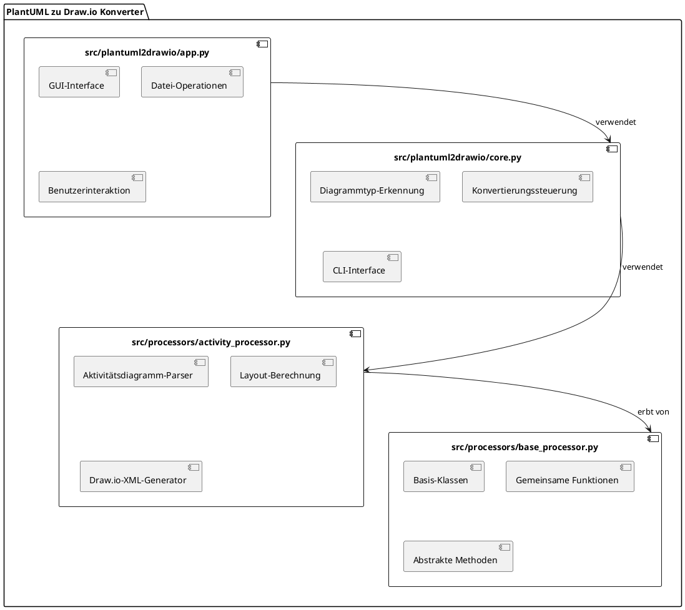

# Komponentendiagramm

Das folgende Komponentendiagramm zeigt die Hauptmodule des PlantUML zu Draw.io Konverters und ihre Abhängigkeiten:

## Hauptkomponenten

1. **src/plantuml2drawio/core.py**
   - Kernkomponente des Systems
   - Steuert den Konvertierungsprozess
   - Bietet die Kommandozeilenschnittstelle
   - Erkennt den Diagrammtyp
   - Koordiniert die Verarbeitung

2. **src/processors/activity_processor.py**
   - Spezialisierte Komponente für Aktivitätsdiagramme
   - Parst PlantUML-Aktivitätsdiagramme
   - Berechnet das Layout
   - Generiert das Draw.io-XML

3. **src/plantuml2drawio/app.py**
   - Grafische Benutzeroberfläche
   - Bietet Dateioperationen
   - Visualisiert den Konvertierungsprozess
   - Zeigt Ergebnisse und Fehler an

4. **src/processors/base_processor.py**
   - Basisklasse für alle Diagramm-Prozessoren
   - Definiert die gemeinsame Schnittstelle
   - Stellt Basis-Klassen für Diagrammelemente bereit

## Komponenteninteraktionen

- **src/plantuml2drawio/core.py** übernimmt die Koordination und generische Funktionalität
- **src/processors/activity_processor.py** implementiert die spezifische Logik für Aktivitätsdiagramme
- **src/plantuml2drawio/app.py** behandelt nur UI-bezogene Aspekte
- **src/processors/base_processor.py** definiert die gemeinsame Schnittstelle für alle Prozessoren

## Modulare Architektur

Das Diagramm veranschaulicht die klare Trennung der Verantwortlichkeiten zwischen den Modulen:

- **src/plantuml2drawio/core.py** übernimmt die Koordination und generische Funktionalität
- **src/processors/activity_processor.py** konzentriert sich ausschließlich auf Aktivitätsdiagramme
- **src/plantuml2drawio/app.py** behandelt nur UI-bezogene Aspekte

Diese Architektur erleichtert die zukünftige Erweiterung um weitere Diagrammtypen. Neue Prozessoren können als separate Module hinzugefügt werden, ohne bestehenden Code zu verändern.
