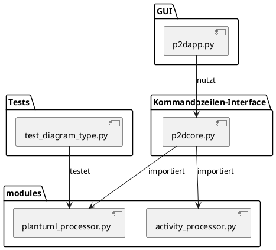
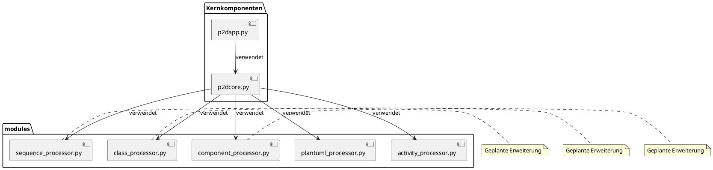

# Systemarchitektur

Dieses Dokument beschreibt die aktuelle Architektur des PlantUML zu Draw.io Konverters.

## Überblick

Das System ist modular aufgebaut und besteht aus folgenden Hauptkomponenten:

1. **p2dcore.py**: Die Kernkomponente, die den Konvertierungsprozess steuert
2. **modules/plantuml_processor.py**: Modul für die Erkennung von PlantUML-Diagrammtypen
3. **modules/activity_processor.py**: Spezialisiertes Modul für die Verarbeitung von Aktivitätsdiagrammen
4. **p2dapp.py**: Grafische Benutzeroberfläche für den Konverter

## Komponentendiagramm

## Komponenten im Detail

### p2dcore.py

Die zentrale Steuerungskomponente des Systems:

- Enthält den Haupteinstiegspunkt für die Kommandozeilenverarbeitung
- Analysiert Kommandozeilenparameter
- Koordiniert den Gesamtprozess der Konvertierung
- Liest die Eingabedateien und schreibt die Ausgabedateien
- Ruft die spezialisierten Module für die jeweiligen Diagrammtypen auf

#### Hauptfunktionen:

- `process_file(input_file, output_file, info_only)`: Steuert den gesamten Konvertierungsprozess
- `main()`: Verarbeitet Kommandozeilenargumente und ruft `process_file` auf

### modules/plantuml_processor.py

Dieses Modul ist verantwortlich für:

- Erkennung des PlantUML-Diagrammtyps aus dem Quellcode
- Validierung von PlantUML-Aktivitätsdiagrammen
- Bereitstellung von gemeinsam genutzten Funktionen und Klassen für verschiedene Diagrammtypen

#### Hauptfunktionen:

- `determine_plantuml_diagram_type(plantuml_content)`: Identifiziert den Typ eines PlantUML-Diagramms
- `is_valid_plantuml_activitydiagram(plantuml_content)`: Überprüft, ob ein Diagramm ein gültiges Aktivitätsdiagramm ist

### modules/activity_processor.py

Spezialisiertes Modul für die Verarbeitung von Aktivitätsdiagrammen:

- Parsing des PlantUML-Codes für Aktivitätsdiagramme
- Berechnung des Layouts für die Diagramm-Elemente
- Erzeugung des Draw.io-XML-Formats für Aktivitätsdiagramme

#### Hauptfunktionen:

- `parse_plantuml_activity(plantuml_content)`: Extrahiert Knoten und Kanten aus dem PlantUML-Code
- `layout_activity(nodes, edges)`: Berechnet ein sinnvolles Layout für die Diagramm-Elemente
- `create_drawioxml_activity(nodes, edges)`: Erzeugt das Draw.io-XML für ein Aktivitätsdiagramm
- `create_json(nodes, edges)`: Erstellt eine JSON-Repräsentation des Diagramms

### p2dapp.py

Grafische Benutzeroberfläche:

- Bietet eine benutzerfreundliche Alternative zur Kommandozeile
- Ermöglicht die Eingabe von PlantUML-Code
- Visualisiert den Konvertierungsprozess
- Zeigt Ergebnisse und Fehler an

## Datenfluss

Der typische Datenfluss durch das System:

1. **Eingabe**: PlantUML-Code (aus Datei oder GUI)
2. **Diagrammtyp-Erkennung**: Bestimmung des Diagrammtyps durch `determine_plantuml_diagram_type()`
3. **Spezialisierte Verarbeitung**: Weiterleitung an das entsprechende Verarbeitungsmodul (derzeit nur Aktivitätsdiagramme)
4. **Parsing**: Extraktion der Diagramm-Elemente (Knoten und Kanten)
5. **Layout-Berechnung**: Bestimmung der Position jedes Elements
6. **XML-Generierung**: Erstellung des Draw.io-kompatiblen XML-Formats
7. **Ausgabe**: Speicherung als Draw.io-Datei (oder Anzeige in der GUI)

## Zukünftige Architektur

Mit der geplanten Unterstützung weiterer Diagrammtypen wird sich die Architektur wie folgt erweitern:

Jedes neue Diagrammtyp-Modul wird dabei ein ähnliches Interface implementieren, wodurch die Erweiterbarkeit des Systems sichergestellt wird. 