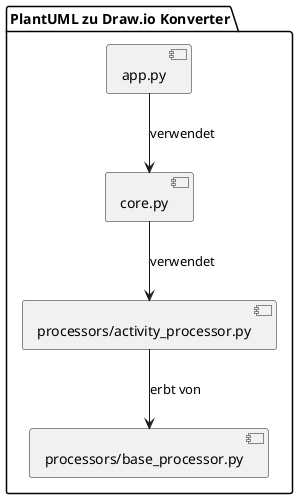
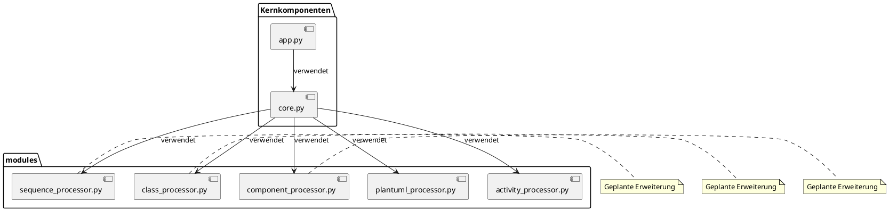

# Systemarchitektur

Dieses Dokument beschreibt die aktuelle Architektur des PlantUML zu Draw.io Konverters.

## Überblick

Das System ist modular aufgebaut und besteht aus folgenden Hauptkomponenten:

1. **core.py**: Die Kernkomponente, die den Konvertierungsprozess steuert
2. **processors/activity_processor.py**: Modul zur Verarbeitung von Aktivitätsdiagrammen
3. **processors/base_processor.py**: Basisklasse für alle Diagramm-Prozessoren
4. **app.py**: Grafische Benutzeroberfläche für den Konverter

## Komponentendiagramm

## Komponenten im Detail

### core.py

Die Kernkomponente übernimmt folgende Aufgaben:

1. Parsen von Kommandozeilenargumenten
2. Erkennen des PlantUML-Diagrammtyps
3. Auswahl des entsprechenden Verarbeitungsmoduls
4. Koordination des Konvertierungsprozesses
5. Ausgabe des Ergebnisses im gewünschten Format

### processors/activity_processor.py

Spezialisiertes Modul für die Verarbeitung von Aktivitätsdiagrammen:

- Parsing des PlantUML-Codes für Aktivitätsdiagramme
- Berechnung des Layouts für die Diagramm-Elemente
- Erzeugung des Draw.io-XML-Formats für Aktivitätsdiagramme

#### Hauptfunktionen:

- `parse_plantuml_activity(plantuml_content)`: Extrahiert Knoten und Kanten aus dem PlantUML-Code
- `layout_activity(nodes, edges)`: Berechnet ein sinnvolles Layout für die Diagramm-Elemente
- `create_drawioxml_activity(nodes, edges)`: Erzeugt das Draw.io-XML für ein Aktivitätsdiagramm
- `create_json(nodes, edges)`: Erstellt eine JSON-Repräsentation des Diagramms

### processors/base_processor.py

Basisklasse für alle Diagramm-Prozessoren:

- Enthält gemeinsame Funktionen und Attribute für alle Diagramm-Prozessoren
- Stellt eine Schnittstelle für alle Diagramm-Prozessoren bereit

### app.py

Die grafische Benutzeroberfläche bietet:

1. Ein Textfeld zur Eingabe des PlantUML-Codes
2. Funktionen zum Laden und Speichern von Dateien
3. Eine Schaltfläche zum Starten der Konvertierung
4. Erkennung des Diagrammtyps
5. Anzeige von Statusmeldungen

## Datenfluss

Der typische Datenfluss durch das System:

1. **Eingabe**: PlantUML-Code (aus Datei oder GUI)
2. **Diagrammtyp-Erkennung**: Bestimmung des Diagrammtyps durch `determine_plantuml_diagram_type()`
3. **Spezialisierte Verarbeitung**: Weiterleitung an das entsprechende Verarbeitungsmodul (derzeit nur Aktivitätsdiagramme)
4. **Parsing**: Extraktion der Diagramm-Elemente (Knoten und Kanten)
5. **Layout-Berechnung**: Bestimmung der Position jedes Elements
6. **XML-Generierung**: Erstellung des Draw.io-kompatiblen XML-Formats
7. **Ausgabe**: Speicherung als Draw.io-Datei (oder Anzeige in der GUI)

## Zukünftige Architektur

Mit der geplanten Unterstützung weiterer Diagrammtypen wird sich die Architektur wie folgt erweitern:

Jedes neue Diagrammtyp-Modul wird dabei ein ähnliches Interface implementieren, wodurch die Erweiterbarkeit des Systems sichergestellt wird.
